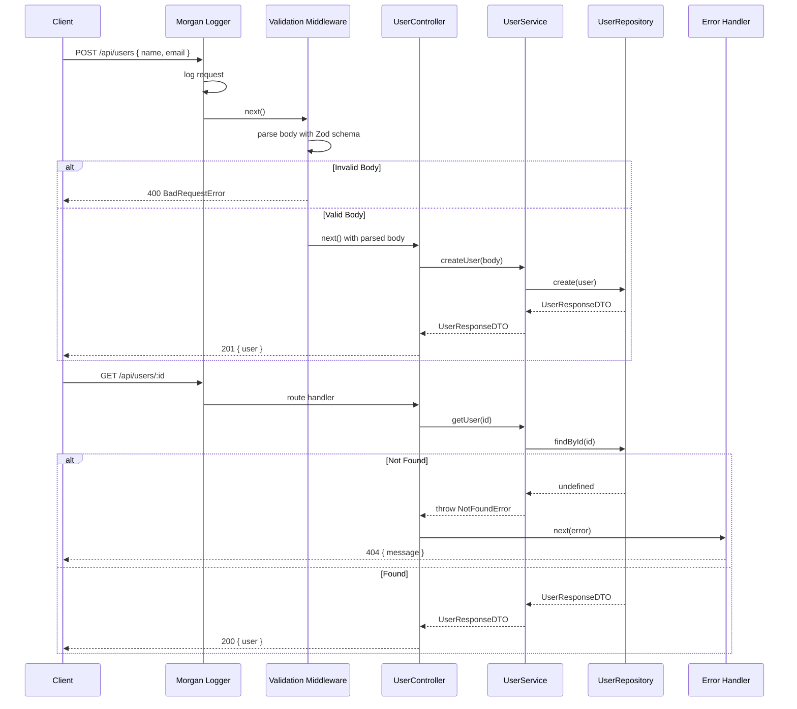

# NEETCODE — ts107: Typed REST API

## N — Nature / Overview

A production-grade Express + TypeScript backend with Zod validation, clean architecture (controller → service → repository), middleware chain, and integration testing. Teaches: full-stack TypeScript backend patterns, DTOs, typed error handling, layered architecture.

**Role**: Capstone backend project — unifies all prior concepts (generics, async, DI, types) into a cohesive API.

---

## E — Execution Flow (Sequence Diagram)



---

## E — Edge Cases

| Scenario | Handling |
|----------|----------|
| Missing/invalid request body | Zod schema rejects, returns 400 BadRequestError |
| Non-existent user ID | 404 NotFoundError with descriptive message |
| Invalid email format | Zod `.email()` validation rejects |
| Name too short (< 2 chars) | Zod `.min(2)` validation rejects |
| Negative age | Zod `.positive()` validation rejects |
| Unexpected error | Global error handler catches all, returns 500 |
| Malformed JSON payload | Express `json()` parser handles, passes to error handler |

---

## T — Type System & Complexity

**Type constructs**: Zod-inferred types (`z.infer<>`), generic `RequestHandler<Params, ResBody, ReqBody>`, interface augmentation, class hierarchies

**Time complexity**:
- CRUD operations: O(1) — in-memory Map
- List: O(n)

**Space complexity**: O(n) for n users

---

## C — Core Patterns (Design Patterns)

| Pattern | Usage |
|---------|-------|
| **Clean Architecture** | Controller → Service → Repository (strict layer separation) |
| **Dependency Injection** | Repository → Service → Controller (constructor injection) |
| **Factory Pattern** | `makeUserController(service)` creates controller handlers |
| **Middleware Chain** | Validation → Controller → Error Handler pipeline |
| **DTO Pattern** | `CreateUserDTO`, `UpdateUserDTO`, `UserResponseDTO` with Zod |
| **Error Hierarchy** | `ApiError` → `NotFoundError`, `BadRequestError` |
| **Logger Interface** | Pluggable logger via `ILogger` |

---

## O — Optimization Notes

- In-memory repository is for demo — swap with Prisma/TypeORM for production
- Add pagination for `GET /users` when dataset grows
- Add rate limiting middleware (express-rate-limit)
- Add request ID tracking for distributed tracing
- Add OpenAPI/Swagger documentation via zod-to-openapi
- Consider circuit breaker for external API calls

---

## D — Dependencies & Config

| Dependency | Version | Purpose |
|------------|---------|---------|
| express | ^4.18 | HTTP framework |
| zod | Latest | Runtime validation + type inference |
| morgan | Latest | HTTP request logging |
| dotenv | Latest | Environment config |
| TypeScript | ^5.9 | Compiler (ES2021 target, ES2022 modules) |
| Jest + ts-jest | 30.x/29.x | Testing |
| Supertest | Latest | HTTP integration testing |
| ESLint | 9.x (flat config) | Linting |
| Prettier | Latest | Formatting |

---

## E — Evaluation / Testing

```
npm test     → unit + integration tests pass
npm run build → tsc compiles cleanly
npm run lint → ESLint flat config passes
npm start    → Express on :3000
```

**CI**: GitHub Actions (matrix: Node 20/22 → lint → build → test → coverage)
**Coverage**: >85%
